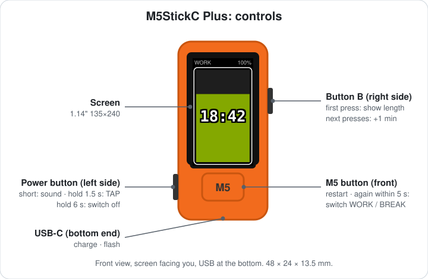
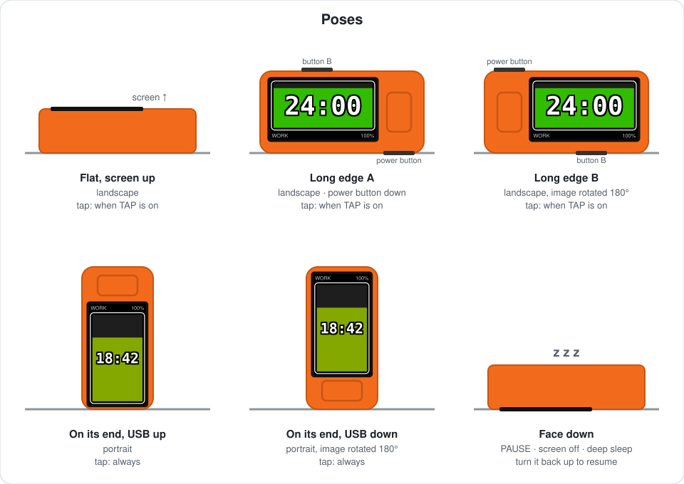
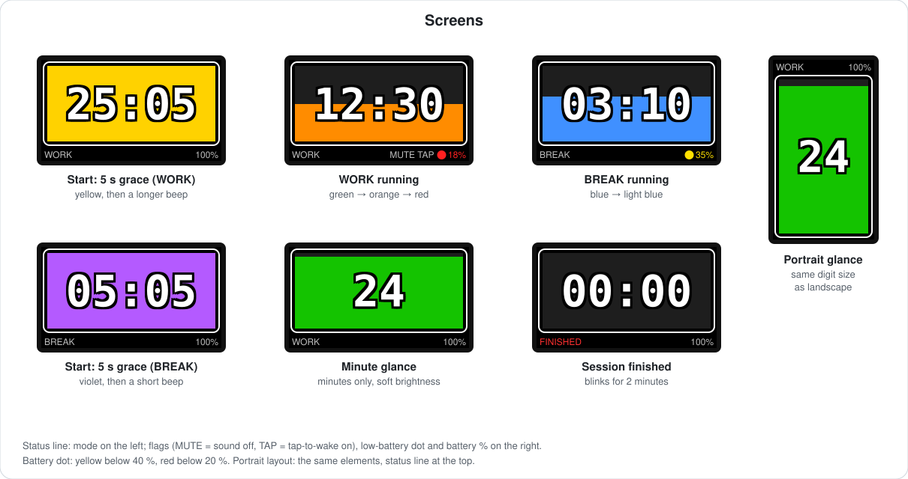

# M5StickPomodoro

A standalone, battery-friendly Pomodoro timer for the **M5StickC Plus**.

You control it mostly by **how the device is placed**: put it face down to pause, stand it on its end to see a big countdown bar, tap the table to glance at it. Three buttons cover the rest. It needs no phone, no Wi-Fi, no Bluetooth and no cloud. Flash it once and it just works.

> **Supported models:** M5StickC Plus (main target) and the original M5StickC (no buzzer: it signals with its red LED).
> One firmware detects the board at boot. Adding a similar model is one row in [`src/boards.h`](src/boards.h); see [PORTING.md](PORTING.md).



## TL;DR

**Two modes**
- **WORK** — 25 min by default, the bar goes green → orange → red.
- **BREAK** — 5 min by default, the bar goes blue → light blue.
- Power-on always starts WORK.
- Every session starts with a **5-second grace period** (yellow for WORK, violet for BREAK), then a beep, and the countdown begins.

**Buttons** (they work the same in WORK and BREAK; B changes the length of the mode you are in)

| Button | Press | Hold |
|---|---|---|
| **M5** (front, under the screen) | Restart the current mode. Press **again within 5 s** → switch WORK ⇄ BREAK. | — |
| **B** (right side) | 1st press shows the length; each next press **+1 min** (1–60). Starts 1 s after the last press. | Adds minutes quickly. |
| **Power** (left side) | Off: switch on. On, screen lit: **sound on / off**. | **1.5 s**: tap-to-wake in horizontal poses on / off. **6 s**: switch off. |

**Poses**
- **Face down** → pause (screen off, deep sleep).
- **Face up again** → resume exactly where it stopped.
- **Flat or on a long edge** → landscape. On edge B the image flips.
- **On its end** (USB up or down) → portrait.
- **Tapping the table** shows the time for 5 s. On its end this always works; in horizontal poses only with `TAP` on.
- **Once a minute** the remaining minutes fade in and out for 5 s.

**When a session ends** (beeps, then `00:00 FINISHED` blinks for 2 min)
- **Move it to another pose and hold it for 1 s** (edge A ⇄ edge B, or from its end onto its side) → the **other** mode starts: WORK → BREAK, BREAK → WORK.
- **Face down, then face up** → the **same** mode starts again.
- **M5** → same mode (press again within 5 s to switch).
- **B** → set a length and start.
- **Do nothing** → after 2 min it goes to sleep. Flip it or press M5 later.

**Supported models** (one firmware for all; the board is detected at boot)

| Model | Notes |
|---|---|
| **M5StickC Plus v1.1** | Main target; all features as described here. |
| **M5StickC (original)** | No buzzer: the red LED blinks instead of beeping, and the power button's short press switches the LED (`LED ON` / `LED OFF`). Smaller 80×160 screen: compact status line, in portrait on two lines. Only units with the MPU6886 IMU (early SH200Q units are not supported). |

**Flashing**
1. Install [PlatformIO](https://platformio.org/).
2. Connect the device over USB and switch it on.
3. Run `scripts/flash.sh` from the repository folder.
4. Choose the device from the list, check what the script found (model, chip, current firmware), and confirm.

Details: [Build and flash](#build-and-flash).

---

## Contents

- [TL;DR](#tldr)
- [Features at a glance](#features-at-a-glance)
- [Cheat sheet](#cheat-sheet)
- [How it works](#how-it-works)
  - [Switching on and off](#switching-on-and-off)
  - [Two modes: WORK and BREAK](#two-modes-work-and-break)
  - [Starting a session and the grace period](#starting-a-session-and-the-grace-period)
  - [While a session runs](#while-a-session-runs)
  - [Pausing and resuming](#pausing-and-resuming)
  - [When a session ends](#when-a-session-ends)
  - [Poses and screen layouts](#poses-and-screen-layouts)
  - [The screen](#the-screen)
  - [Tap to wake](#tap-to-wake)
  - [Sound](#sound)
  - [Battery indicator](#battery-indicator)
  - [What is remembered](#what-is-remembered)
- [Build and flash](#build-and-flash)
- [Power design and battery life](#power-design-and-battery-life)
- [Hardware notes](#hardware-notes)
- [Known limitations](#known-limitations)
- [Project layout](#project-layout)

---

## Features at a glance

- **Two timers:** WORK (default 25 min) and BREAK (default 5 min), each with its own length (1–60 min).
- **Face down pauses, face up resumes**, exactly where it stopped.
- **Five screen layouts:** flat, either long edge, and either end. The image is always upright.
- **Countdown bar** behind the digits that drains every second and changes colour:
  - WORK: green → orange → red;
  - BREAK: blue → light blue.
- **Unobtrusive display:** a 5-second glance once a minute that shows only the minutes and gently steps the brightness up and down.
- **Tap the table** to see the full `MM:SS` for 5 seconds. Always on when standing on an end, switchable for horizontal poses.
- **5-second grace period** at the start of every session, so you can change your mind and switch modes. A start beep marks the moment the session really begins.
- **Distinct sounds** for the start and end of WORK and BREAK. Sound can be muted.
- **End of session:** the screen blinks for 2 minutes. Move the device to another pose to start the other mode, or turn it face down and back to repeat the same one.
- **Low-battery warning** that you can see from across the room: a yellow dot below 40 %, red below 20 %.
- **Very low power:** light sleep while running, deep sleep while paused, crystal RTC timekeeping, radios never turned on.

---

## Cheat sheet

| You do | It does |
|---|---|
| **Switch on:** press the **power** button (left side) | The device starts and begins a new WORK session. |
| **Switch off:** hold the **power** button for **about 6 seconds** | The screen goes dark and the device powers off completely. |
| Put it **face down** | Pauses. The screen goes dark and the device sleeps deeply. |
| Turn it **face up** (any visible pose) | Resumes from exactly where it paused. |
| **M5** button (big, under the screen) | Restarts the current mode. |
| **M5** again within 5 s (during the yellow / violet grace period) | Switches to the other mode and starts it. |
| **B** button (right side), first press | Shows the current mode's length (`SET WORK` / `SET BREAK`). |
| **B** further presses / hold | +1 minute per press (wraps 60 → 1); holding repeats quickly. The session starts 1 s after the last press. |
| **Power** button (left side), short press, screen on | Sound on / off (`SOUND ON` / `SOUND OFF`). |
| **Power** button, hold ~1.5 s, screen on | Tap-to-wake in horizontal poses on / off (`TAP ON` / `TAP OFF`). |
| Tap the table (tap poses) | Shows the full `MM:SS` for 5 s. |
| Session ends, then move it to another pose for 1 s | Starts the other mode (WORK → BREAK or BREAK → WORK). |
| Session ends, then face down and back up | Starts the same mode again. |

---

## How it works

### Switching on and off

- **On:** press the **power button** on the left side (screen facing you, USB at the bottom). A new WORK session starts right away.
- **Off:** **hold the power button for about 6 seconds** until the screen goes dark. The power chip (AXP192) cuts the power completely. The timer stops and nothing runs until you switch it on again.
- **On USB:** while the cable is connected the device is powered and charging; you still switch it off the same way.
- **What survives switching off:** both session lengths, the sound setting and the tap setting. The running session does not: switching on always starts a fresh WORK session.
- Holding the button to switch off passes the 1.5-second mark that toggles `TAP`, so `TAP ON` / `TAP OFF` may flash on the way. The device powers off before that change is saved, so your tap setting stays as it was.
- You don't need to switch it off between sessions: face down it sleeps deeply and draws very little power.

### Two modes: WORK and BREAK

| | WORK | BREAK |
|---|---|---|
| Default length | 25 min | 5 min |
| Bar colour while running | green → orange → red | blue → light blue |
| Grace-period colour | yellow | violet |
| Start signal | one longer beep | one short beep |
| End signal | three short beeps | two long beeps |
| Status label | `WORK` | `BREAK` |

Power-on always starts **WORK**. Switch modes with a second press of the M5 button during the grace period, or by changing the pose when a session ends.

### Starting a session and the grace period

Every session — after power-on, after the M5 or B button, or after a mode switch — starts with a **5-second grace period**:

- A 25-minute session starts at **25:05** and a 5-minute session at **5:05**.
- During those 5 seconds the bar is **yellow** (WORK) or **violet** (BREAK).
- Pressing **M5** again in that window switches to the other mode, which starts with its own grace period. Each further quick press switches again.
- When the grace period ends, the **start signal** sounds and the bar takes the mode's colour. The timer then shows exactly the full length, e.g. `25:00`.

### While a session runs

The timer keeps running in every pose where the screen faces you. To save battery and stay out of your way, the screen stays dark most of the time. It turns on:

- **Once a minute (glance):** at every minute mark the screen shows only the remaining **minutes** (e.g. `24`), static, while the backlight steps up and down over 5 seconds (levels 7 → 8 → 8 → 8 → 7). The two digits are as large as the landscape `MM:SS` in every pose, so in portrait they are much bigger than the full portrait time.
- **For 5 seconds with the full `MM:SS`:** when a session starts or resumes, when the device moves to a different pose, or when you tap the table in a tap pose.

### Pausing and resuming

- **Face down** (held for ~0.3 s) pauses the timer immediately. The screen and its power supply turn off and the ESP32 enters deep sleep.
- The accelerometer stays awake in a micro-power mode. When the device moves, it wakes the ESP32, which checks the pose **before** turning on the screen. A bump while still face down just goes back to sleep without lighting anything.
- **Turning it face up** (or onto any visible pose) resumes the timer from the exact remaining time, to the millisecond.
- There is a hysteresis band between "face down" (z < −0.6 g) and "visible" (z > −0.3 g), so tilting the device does not flip it between states.

### When a session ends

1. The end signal sounds: three short beeps for WORK, two long beeps for BREAK.
2. `00:00 FINISHED` **blinks** (500 ms on / 500 ms off) for **2 minutes**.
3. During the blinking you can:
   - **move the device to another pose and hold it there for 1 second** (e.g. from one long edge to the other, or from standing on an end to lying on its side) → the **other** mode starts;
   - press **M5** → the same mode restarts (press again within 5 s to switch);
   - press **B** → set a length and start;
   - turn it **face down** → the screen turns off at once.
4. After the blinking (or face down), the device deep-sleeps until:
   - it is turned **face down and back up** → the **same** mode starts again;
   - the **M5** button is pressed → the same mode starts.

### Poses and screen layouts



| Pose | Layout | Tap to wake |
|---|---|---|
| Flat, screen up | landscape | when `TAP` is on |
| On long edge A | landscape | when `TAP` is on |
| On long edge B | landscape, rotated 180° | when `TAP` is on |
| On its end, USB up | portrait | always |
| On its end, USB down | portrait, rotated 180° | always |
| Face down | — (paused) | — |

A new pose must be stable for a few samples (~0.5 s) before the layout changes. A layout change shows the screen for 5 seconds.

### The screen



- **Bar:** a white rounded frame with a bar inside whose level drops every second in proportion to the remaining time and changes colour with the mode.
- **Time:** large digits in the middle with a black halo, so they stay readable over any bar colour.
- **Status line:** at the bottom in landscape, at the top in portrait. It shows:
  - left: `WORK`, `BREAK`, `SET WORK`, `SET BREAK`, `PAUSED` or `FINISHED` (red);
  - right: battery percentage, a low-battery dot, and the flags `MUTE` (sound off) and `TAP` (tap-to-wake on in horizontal poses; not shown in portrait, where tapping always works).
- **Banners:** `SOUND ON` / `SOUND OFF` and `TAP ON` / `TAP OFF` appear in a box over the time for 2 seconds.

### Tap to wake

When the screen is dark, a light tap on the table (or any small vibration) shows the full `MM:SS` for 5 seconds.

- **Standing on an end:** always on.
- **Flat and on both long edges:** off by default. Toggle it by holding the power button for ~1.5 s while the screen is on.
- In tap poses the accelerometer samples at 100 Hz with a 40 mg threshold to catch light taps. Otherwise it samples at 12.5 Hz with an 80 mg threshold to save power and ignore the desk.

The power button's long press is reported by the power chip at 1.5 s, while you are still holding the button. The `TAP` setting therefore changes at once but is **saved only 6 seconds later**. If you keep holding the button to switch the device off, it powers down before the change is saved, so switching off never changes the setting.

### Sound

- A **short press** of the power button, while the screen is on, toggles the sound. `MUTE` shows in the status line while the sound is off.
- Power-button presses while the screen is dark are ignored, so you cannot change anything by accident in your bag.

### Battery indicator

- The percentage is always shown in the status line.
- **Below 40 %:** a bright **yellow** dot appears and the percentage turns yellow.
- **Below 20 %:** both turn bright **red**, visible from a distance.
- Right after power-on the power chip needs a moment to measure the battery. Until it has a value, nothing is shown, rather than a misleading `0%`.

### What is remembered

| Setting | Survives power-off | Changed with |
|---|---|---|
| WORK length | yes | B button in WORK |
| BREAK length | yes | B button in BREAK |
| Sound on / off | yes | short press of power button |
| Tap-to-wake in horizontal poses | yes | long press of power button |
| Current session, mode, pause state | across sleep only | — |

Power-on always starts a fresh WORK session. Settings are written to flash only when they change, never to track the countdown.

---

## Build and flash

You need [PlatformIO](https://platformio.org/), either the CLI or the VS Code extension. PlatformIO downloads everything else: the `espressif32@6.4.0` platform and the `M5Unified@0.2.25` library (with M5GFX).

1. Connect the M5Stick over USB and **switch it on**. The USB serial port only exists while the device is powered.
2. Flash with the helper script:
   ```bash
   scripts/flash.sh
   ```
   It lists the connected devices and lets you **choose one**; the others are not touched. Then it checks the chosen
   device and shows its chip, flash size, MAC, model and current firmware. It restarts the device once to read its
   boot log. It flashes only after you confirm.
   - `--port /dev/cu.usbserial-XXXX` picks the device directly.
   - `--expect "M5StickC"` refuses to flash unless the device is identified as that model.
   - `--yes` skips the questions; `--list` only lists the devices; `--env test` flashes the test build.
   - On macOS, the VoiceOver braille service (`scrod`) grabs new USB serial ports and blocks flashing. The script stops it
     when it holds the chosen port.

   Plain PlatformIO works too: `pio run -t upload --upload-port /dev/cu.usbserial-XXXX`.
3. Optionally, watch the log:
   ```bash
   pio device monitor
   ```
   On boot you should see `profile=M5StickC Plus` (or `M5StickC`), `IMU INT self-test: asserted=1 released=1` and
   `WORK: new 25 min session`.

A test build with a 2-minute default WORK session:
```bash
scripts/flash.sh --env test
```
Lengths already set with the B button are stored in flash and override the defaults. The defaults come from `-DSESSION_MIN=25` and `-DBREAK_MIN=5`.

---

## Power design and battery life

- **Radios off:** Wi-Fi and Bluetooth are never initialised.
- **CPU and supplies:** the CPU runs at 80 MHz. The AXP192 5 V boost (EXTEN) is on only while beeping, because the buzzer is powered from it.
- **Running:** the ESP32 is in light sleep. It is woken by a hardware timer at the next minute mark, by the buttons, or by the accelerometer interrupt on GPIO35.
- **Paused / finished:** deep sleep with the backlight (LDO2) and the LCD logic supply (LDO3) off. It wakes on the MPU6886 wake-on-motion interrupt and, after a session ends, on the M5 button.
- **Timekeeping:** the BM8563 crystal RTC keeps time, not the ESP32's drifting RC sleep clock. Pause and resume are aligned to the RTC second tick.
- **Display:** the screen is dark except for the short glances; frames are rendered off-screen and pushed in one go.
- **Flash:** written only when a setting changes.

**Estimated battery life** (calculated, not measured; 120 mAh battery):

| State | Estimated current | Estimated runtime |
|---|---|---|
| Session running | ≈ 3.5–4 mA | ≈ 30 h of continuous counting |
| Paused / finished (deep sleep) | ≈ 0.1–0.5 mA | weeks |

Extra screen time from taps and pose changes and frequent beeps reduce these numbers.

---

## Hardware notes

Found while building this on the device:

- **MPU6886:** in low-power cycle mode it reads ~0 g unless `ACCEL_CONFIG2` has `DLPF_CFG = 7`.
- **Buzzer:** the buzzer (GPIO2) is powered from the AXP192 5 V boost (EXTEN) and stays silent without it.
- **GPIO35:** shared by the MPU6886 INT (configured open-drain) and the BM8563 INT (its interrupts are disabled).
- **Power button:** wired to the AXP192, not to the ESP32. Short and long presses are latched in AXP192 register `0x46` and read over I2C; the chip reports no release event. The minimum visible backlight level is LDO2 level 7 (2.5 V), so the glance fades in 0.1 V steps.
- **USB serial:** the serial port disappears while the device is switched off with the power button (observed on the device), so switch it on before flashing.

## Known limitations

- **B button after a session ends:** it cannot wake the device from deep sleep; ESP32 ext1 cannot wake on "any of these pins low". Use M5 or the face-down/up gesture first.
- **Power button:** works only while the screen is on, because it is polled over I2C.
- **Glance brightness:** it steps instead of fading smoothly. Smoother fading would need software PWM, which keeps the CPU awake.
- **Battery percentage:** it is estimated from the battery voltage and reads high while charging.

## Project layout

```
platformio.ini   environments: m5stick-c-plus (default, all supported models) and test (2-minute WORK session)
src/main.cpp     the firmware
src/boards.h     board profiles: one row per supported model
scripts/flash.sh choose a connected device, check it and flash it (scripts/flash.py does the work)
PORTING.md       supported models, adding a board profile, notes on other M5Stick models
docs/            the diagrams used in this README (SVG)
```
